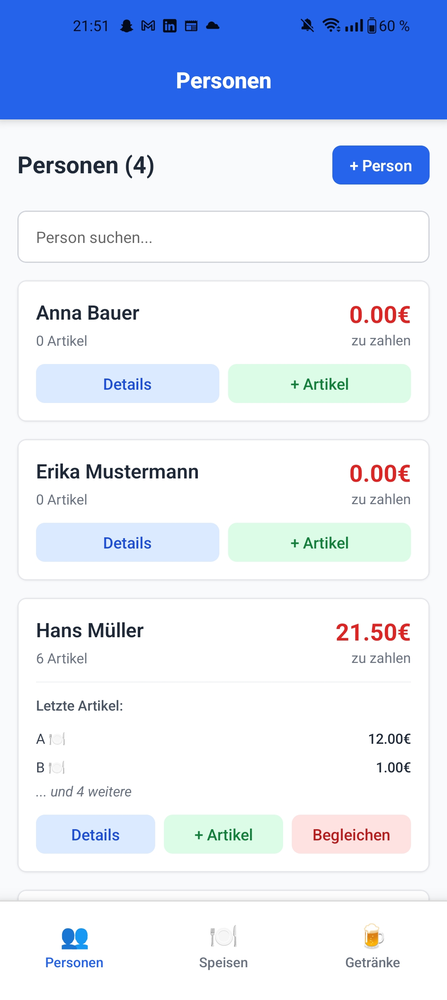
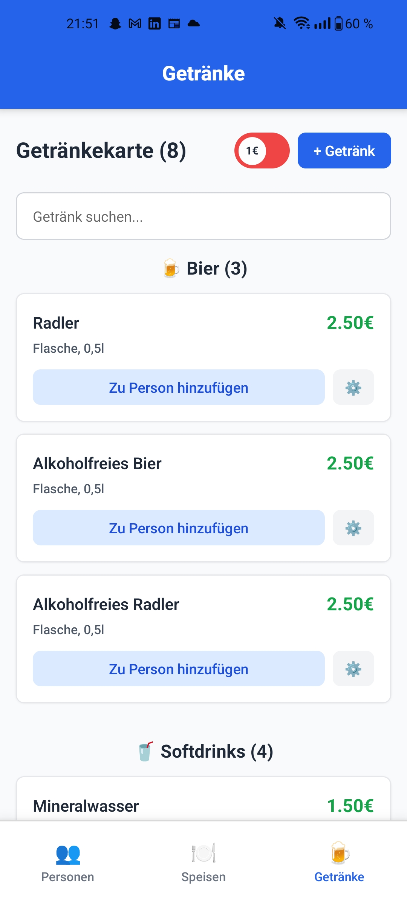
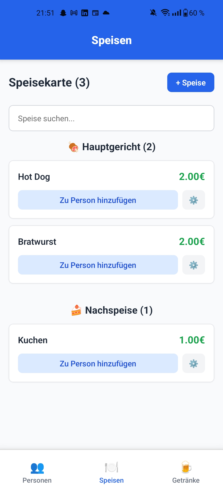
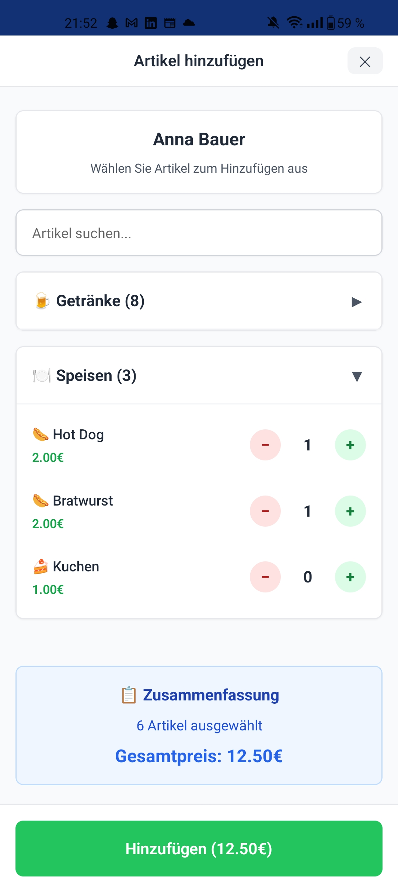
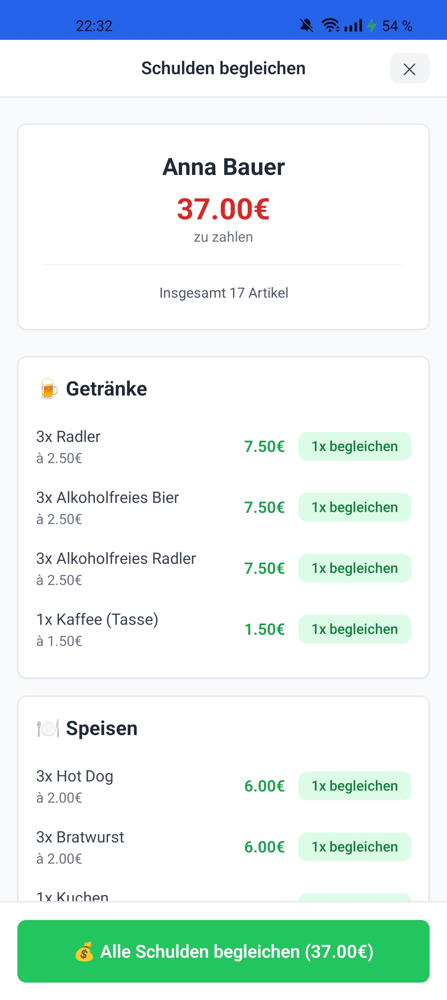
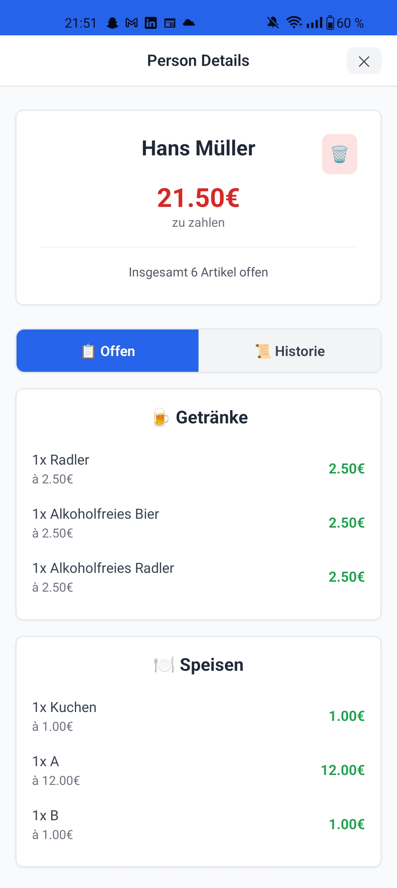
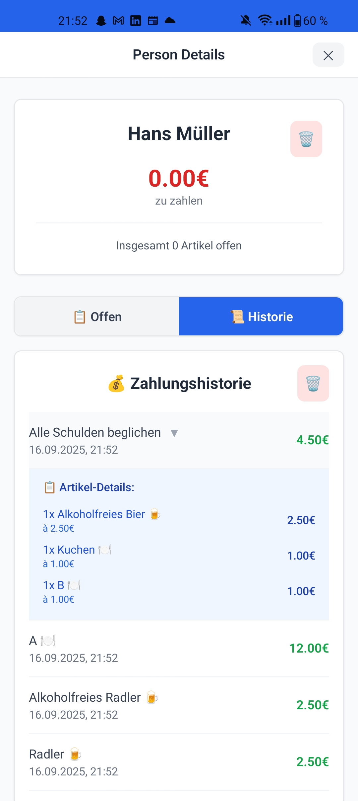
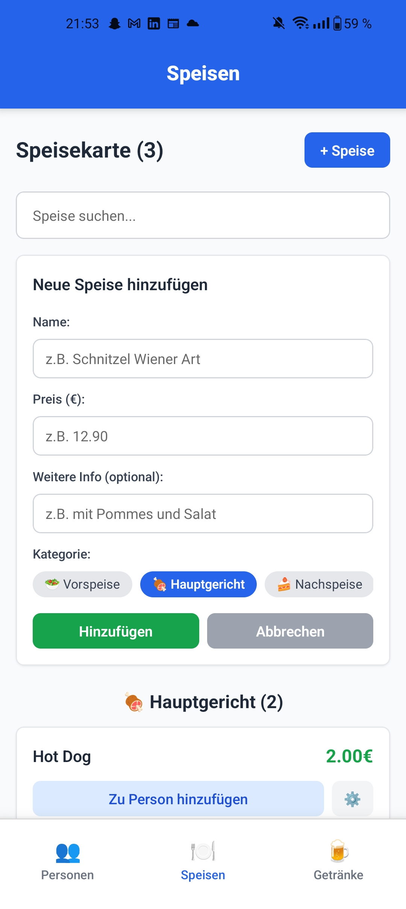
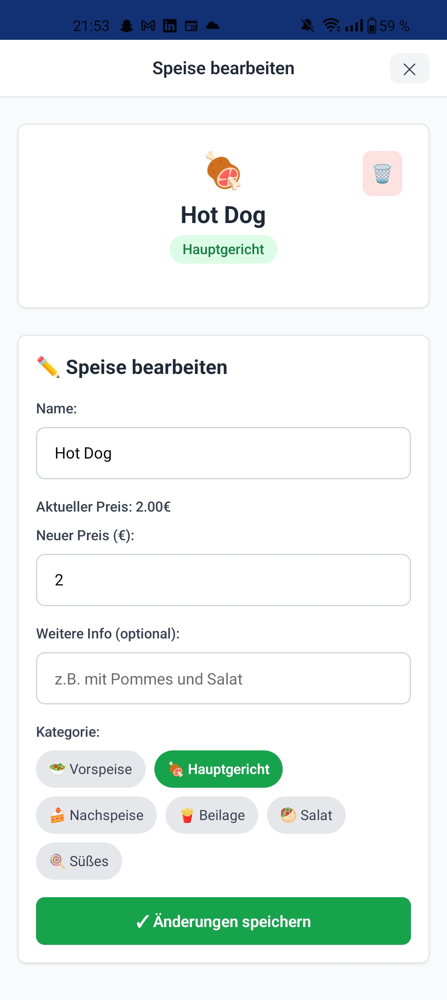
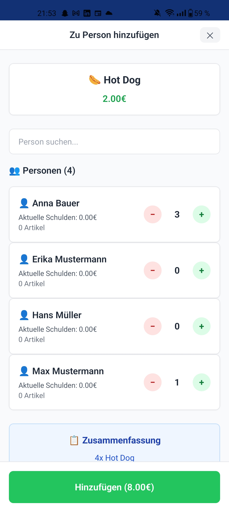

# 🍺 Beer Mat - Digital Tab Tracker

A modern React Native app for tracking food and drink orders at social gatherings, built with Expo Router and styled with TailwindCSS/NativeWind.

## 📱 App Overview

Beer Mat is a digital replacement for traditional beer mats used in German pubs and social clubs. It helps you keep track of who ordered what and how much they owe, making it easy to split bills at the end of the evening.

**Perfect for:**
- Pub nights with friends
- Office parties
- Sports club events
- Family gatherings
- Any group where people order drinks and food throughout the event

## ✨ Features

### 👥 Person Management
- Add and manage people attending your event
- View individual debt totals at a glance
- Comprehensive person details with order history
- Quick search functionality to find people

### 🍺 Drink & Food Management
- Separate tabs for drinks and food items
- Add custom items with prices
- Edit existing items
- Category-based organization

### 📊 Order Tracking
- Add multiple items to any person's tab
- Real-time debt calculation
- Detailed order history per person
- Payment tracking and history

### 💰 Payment Processing
- Pay individual items or entire tabs
- Clear all debts at once
- Detailed payment history
- Visual payment confirmations

## 📸 Screenshots

<div align="center">

### 📱 Main Pages Overview
| Person Page | Drinks Page | Food Page |
|:---:|:---:|:---:|
|  |  |  |

### 👥 Person Page Features
| Add Articles to Person | Pay Debts | Person Details - Open Items | Person Details - History |
|:---:|:---:|:---:|:---:|
|  |  |  |  |

### 🍺🍽️ Food & Drinks Page Features
| Add New Article | Edit Article | Add Article to Person |
|:---:|:---:|:---:|
|  |  |  |

</div>

## 🚀 Quick Start

### Prerequisites
- Node.js (v16 or higher)
- Expo CLI
- iOS Simulator or Android Emulator (optional)

### Installation

1. **Clone the repository**
   ```bash
   git clone https://github.com/yourusername/beer-mat.git
   cd beer-mat
   ```

2. **Install dependencies**
   ```bash
   npm install
   ```

3. **Start the development server**
   ```bash
   npm start
   ```

4. **Run on your device**
   - Scan the QR code with the Expo Go app (iOS/Android)
   - Or press `i` for iOS simulator, `a` for Android emulator

## 🏗️ Tech Stack

- **Framework:** React Native with Expo Router
- **Styling:** TailwindCSS via NativeWind
- **Database:** SQLite with Expo SQLite
- **State Management:** React Context API
- **Navigation:** Expo Router (file-based routing)
- **Language:** TypeScript

## 📱 Platform Support

- ✅ iOS
- ✅ Android  
- ✅ Web (Expo Web)

## 🛠️ Development

### Available Scripts

```bash
npm start          # Start Expo development server
npm run android    # Run on Android
npm run ios        # Run on iOS
npm run web        # Run on web
npm run deploy     # Deploy to web
```

### Project Structure

```
beer-mat/
├── src/
│   ├── app/                   # Expo Router pages
│   │   ├── (tabs)/            # Tab navigation
│   │   │   ├── index.tsx      # People page
│   │   │   ├── getraenke.tsx  # Drinks page
│   │   │   └── speisen.tsx    # Food page
│   │   └── _layout.tsx        # Root layout
│   ├── components/            # Reusable components
│   ├── contexts/              # React contexts
│   ├── db/                    # Database setup & functions
│   ├── types/                 # TypeScript type definitions
│   └── utils/                 # Utility functions
├── assets/                    # Static assets
└── package.json
```

## 🎯 Core Components

### Database Schema
- **Users:** Person management with debt tracking
- **Items:** Food and drink catalog with prices
- **History:** Payment and order tracking

### Key Features Implementation
- **Real-time Updates:** Automatic UI refresh when data changes
- **Debt Calculation:** Automatic price conversion (cents ↔ euros)
- **Payment Tracking:** Detailed history with item breakdowns
- **Search & Filter:** Quick person and item lookup

## 🚀 Deployment

### Expo Application Services (EAS)

Deploy to app stores:
```bash
npx eas-cli build
```

Deploy web version:
```bash
npx eas-cli deploy
```

### Manual Web Deployment
```bash
npm run deploy
```

## 🤝 Contributing

1. Fork the repository
2. Create a feature branch (`git checkout -b feature/amazing-feature`)
3. Commit your changes (`git commit -m 'Add amazing feature'`)
4. Push to the branch (`git push origin feature/amazing-feature`)
5. Open a Pull Request

## 📄 License

This project is licensed under the MIT License - see the [LICENSE](LICENSE) file for details.

## 🎉 Acknowledgments

- Built with [Expo Router](https://docs.expo.dev/router/introduction/)
- Styled with [NativeWind](https://www.nativewind.dev/v4/overview/)
- Inspired by traditional German beer mat systems

---

<div align="center">
  <p>Made with ❤️ for better social gatherings</p>
  <p>🍻 Prost! 🍻</p>
</div>
